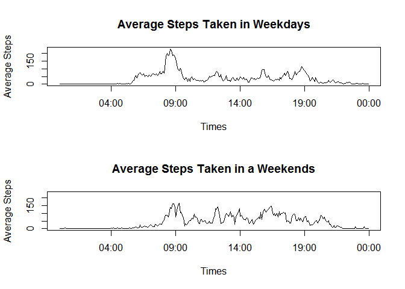

# People Activities
Wanchana Ekakkharanon  
February 10, 2016  

# Monitoring People Activity
All of the functions I used in this script are from a base package of R so, anyone should be able to reproduce it without any problems.

##Loading and preprocessing the data
In order to answer some specific questions of Assesment 1, the script read an input dataset "activity.csv" with R base function "read.csv()"
then store it in "input" variable. Some of the datatype conversion was done by using colClasses arguments within function "read.csv()".


```r
# Read in a csv file
input <- read.csv(file = "./activity.csv", header = TRUE, colClasses = c("numeric", "Date", "numeric"))
```

After the dataset was loaded, we can take a look at the data with "head()" function. You will see lot of missing values in "steps" column but, 
we will ignor missing values for now.


```r
head(input)
```

```
##   steps       date interval
## 1    NA 2012-10-01        0
## 2    NA 2012-10-01        5
## 3    NA 2012-10-01       10
## 4    NA 2012-10-01       15
## 5    NA 2012-10-01       20
## 6    NA 2012-10-01       25
```

## What is mean total number of steps taken per day?
The total steps of each day can be computed by "aggregate.data.frame()" function. This function required a list of columns that you want to group them togather and then compute it with a specific function according to a given function name .


```r
# Calculate the total number of steps taken per day
totalStep_day <- aggregate.data.frame(x = input["steps"], by = list(times = input$date), FUN = sum)
head(totalStep_day)
```

```
##        times steps
## 1 2012-10-01    NA
## 2 2012-10-02   126
## 3 2012-10-03 11352
## 4 2012-10-04 12116
## 5 2012-10-05 13294
## 6 2012-10-06 15420
```

Now,the processed dataset is ready but, before we look at the mean and median, let's see the overview of this dataset first.


```r
# Make a histogram of the total number of steps taken each day.
# Apply The Freedman-Diaconis rule to histogram with " breaks = "FD" " (without outer quotation).
hist(x = totalStep_day$steps, breaks = "FD", xlab = "Steps", main = "Histogram of Steps per Day")
```

\

As you can see from a histogram produced by a script above, most of the days observed, people tend to walk around about 8000 to 15000 steps a day. The exact mean and median can easily be computed by "summary()" function as follow.


```r
summary(totalStep_day$steps)
```

```
##    Min. 1st Qu.  Median    Mean 3rd Qu.    Max.    NA's 
##      41    8841   10760   10770   13290   21190       8
```

## What is the average daily activity pattern?
This time we need to find a daily pattern, the look at average of steps on all time intervals might be useful. we can use "aggregate.data.frame()" function find average of steps on all time intervals with only a little adjustment in some arguments as below.


```r
# Group by time interval and compute means for each interval
meanSteps_interval <- aggregate.data.frame(x = input["steps"], by = list(interval = input$interval), FUN = mean, na.rm = TRUE)
```

You might noticed that the interval column from the original dataset is represent 5 miniute time interval from 00:00 to 23:55, to create an easy to understand plot, I convert them to a Date datatype.


```r
# Format time interval
meanSteps_interval$interval <- sprintf(fmt = "%04d", meanSteps_interval$interval)
meanSteps_interval$times <- strptime(x = meanSteps_interval$interval, format = "%H%M")
```

Let's create a Time-series Plot.


```r
# Make a time series plot.
plot(x = meanSteps_interval$times, y = meanSteps_interval$steps , type = "l", main = "Average Steps Taken in a Day", xlab = "Times", ylab = "Average Steps")
```

\

From a plot, you can clearly see the number of steps rise around 9:00 of the day which is the common time for work. The plot have other 3 more spikes around noon and 18:00 which are probably lunch and going home times. The highest point of Average stpes taken in a day is 206.1698 steps at 8:35 in the morning as show by script below.


```r
# Find time with highest steps in a day
temp <- meanSteps_interval[order(x = meanSteps_interval$steps, decreasing = TRUE), ]
temp$times <- format(x = temp$times, format = "%H:%M")
head(temp[2:3])
```

```
##        steps times
## 104 206.1698 08:35
## 105 195.9245 08:40
## 107 183.3962 08:50
## 106 179.5660 08:45
## 103 177.3019 08:30
## 101 171.1509 08:20
```

# Looking at the number of rows that have missing values. 
Next we will try to fill in missing value and look at the effects that might happen when we ignor them. The number of incomplete rows is 2304 as show below.

```r
# Count the number of incomplete rows
sum(!complete.cases(input))
```

```
## [1] 2304
```

## Imputing missing values
Now, I will try to create a new dataset with the original dataset and fill missing values with Average steps of all time intervals and again padding intervals to 4 digits. 

```r
# Copy original data set to new one
new_data <- input
# padding in 0 to time intervals
new_data$interval <- sprintf(fmt = "%04d", new_data$interval)
```

I wrote "getMeanByInterval()" function in order to extract a mean on specific time interval that we computed in previous time-series plot. The function required 2 arguments a vector of interval of incomplete rows and average steps per day data frame that I already had froma previous step.

```r
# This function return a mean step of specific interval X.
getMeanByInterval <- function(X , meanInterval = list()){
  meanInterval[meanInterval["interval"] == X,]$steps
}
```

Then I can fill in a missing values with a script below.

```r
# Get indeses of incomplete rows
indexes <- as.integer(rownames(new_data[is.na(new_data$steps),]))
# Fill in all NA value with mean of each interval
new_data[indexes,1] <- sapply(X = new_data[indexes,3], FUN = getMeanByInterval, meanSteps_interval)
```

After I got a new and completed dataset, let's compare it to the original. In this step we do the same thing as before by grouping the new dataset by recorded date and find a total steps of each day then, plot a histogram.

```r
# find a totalsteps per day
new_totalStep_day <- aggregate.data.frame(x = new_data["steps"], by = list(times = new_data$date), FUN = sum)
hist(x = new_totalStep_day$steps, breaks = "FD", xlab = "Steps", main = "Histogram of Steps per Day (New Dataset)")
```

\

The distribution showed in a new histogram are pretty much the same as the original.

```r
summary(new_totalStep_day$steps)
```

```
##    Min. 1st Qu.  Median    Mean 3rd Qu.    Max. 
##      41    9819   10770   10770   12810   21190
```

After lookin into a summary of the new dataset. Mean of total steps per day still be the same at 10700 because I use average of steps of each interval to fill a missing value so, it's pretty obvious. The median is changed from 10760 to 10770 becouse the number of observasions is increased.

## Are there differences in activity patterns between weekdays and weekends?
To see a better picture of activity in each day, I have subset the new dataset into 2 by weekends and weekdays. First I need to add indicators for these 2 type of days as follow.

```r
# Create new factor valiable to new dataset
new_data$day.type <- factor(x = ifelse(weekdays(new_data$date) == "Saturday" | weekdays(new_data$date) == "Sunday", yes = "Weekend", no = "weekday"))
```

Then group the new dataset by day.type  variable that i just added with "aggregate.data.frame()" function and compute an average steps on each interval.

```r
# Group by time interval, day.type and compute means for each group
new_meanSteps_interval <- aggregate.data.frame(x = new_data["steps"], by = list(interval = new_data$interval, day.type = new_data$day.type), FUN = mean)
# Format time interval
new_meanSteps_interval$times <- strptime(x = new_meanSteps_interval$interval, format = "%H%M")
```

Two subsets was created and plot alongside each other using "par()" function. 

```r
# Subset the new dataset into 2 by weekend and weekday
weekday <- new_meanSteps_interval[1:288,]
weekend <- new_meanSteps_interval[289:576,]
# Make a 2 time series in one plot using partition (par).
par(mfrow=c(2,1))
plot(x = weekday$times, y = weekday$steps , type = "l", main = "Average Steps Taken in Weekdays", xlab = "Times", ylab = "Average Steps", ylim = range(c(weekday$steps, weekend$steps)))
plot(x = weekend$times, y = weekend$steps , type = "l", main = "Average Steps Taken in a Weekends", xlab = "Times", ylab = "Average Steps", ylim = range(c(weekday$steps, weekend$steps)))
```

\

Now youcan clearly see the different between weekdays and weekends, the average number of stpes on weekday are peaked around a communal working times. On the other hand, the average number of steps on weekend are spreaded throughout the days, this showed that people have more freedom to do anything they want on anyt times so they tend to walk around more than weekdays.
